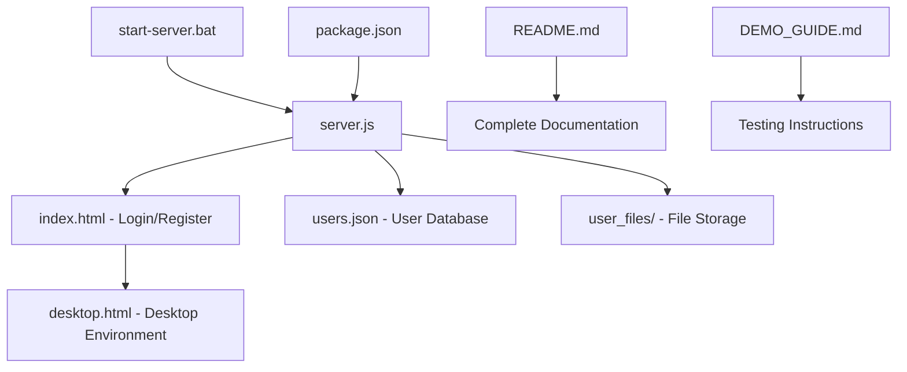

# My_OS Project File Overview 📁

## 📋 Root Directory Files

| File | Purpose | Description |
|------|---------|-------------|
| `README.md` | **Main Documentation** | Complete project overview, features, installation, and usage guide |
| `DEMO_GUIDE.md` | **Testing Guide** | Step-by-step instructions for testing all features |
| `INSTALL.md` | **Quick Setup** | Simple installation instructions for new users |
| `LICENSE` | **Legal** | MIT License for open source distribution |
| `.gitignore` | **Git Configuration** | Files and folders to ignore in version control |
| `start-server.bat` | **Windows Launcher** | One-click server startup script |
| `PROJECT_OVERVIEW.md` | **This File** | Overview of all project files |

## 🖥️ Server Directory (`/server/`)

| File | Purpose | Description |
|------|---------|-------------|
| `server.js` | **Main Backend** | Express server with authentication, API routes, and static file serving |
| `package.json` | **Dependencies** | Node.js project configuration and required packages |
| `index.html` | **Login Page** | Unified login/register page with authentication forms |
| `start-my-os.bat` | **Chrome Launcher** | Opens Chrome with required permissions for full functionality |

## 🌐 Client Directory (`/server/client/public/`)

| File | Purpose | Description |
|------|---------|-------------|
| `desktop.html` | **Desktop Environment** | Complete web-based OS interface with all applications |

## 🗂️ Auto-Generated Directories (Created at Runtime)

| Directory | Purpose | Description |
|-----------|---------|-------------|
| `user_files/` | **User Storage** | Individual user file storage (created automatically) |
| `node_modules/` | **Dependencies** | NPM packages (created by `npm install`) |
| `users.json` | **User Database** | Stores registered user accounts (created automatically) |

## 🔄 File Relationships

## 🚀 Application Architecture

### Frontend (Client-Side)
- **`index.html`** - Authentication interface with JWT token management
- **`desktop.html`** - Complete desktop environment with:
  - Window management system
  - 12+ applications (Browser, Calculator, Camera, Games, etc.)
  - System tray and taskbar
  - Real-time UI updates

### Backend (Server-Side)
- **`server.js`** - Express.js server providing:
  - User authentication (registration/login)
  - JWT token validation
  - Static file serving
  - API endpoints for user management
  - File upload/download capabilities

## 🛠️ Technology Stack

| Layer | Technologies |
|-------|-------------|
| **Frontend** | HTML5, CSS3, Vanilla JavaScript, Canvas API, WebRTC |
| **Backend** | Node.js, Express.js, JWT, bcrypt |
| **Database** | JSON file storage (users.json) |
| **Authentication** | JWT tokens with bcrypt password hashing |
| **File System** | Local filesystem with user directories |

## 📊 Code Statistics

| File Type | Lines of Code | Description |
|-----------|---------------|-------------|
| `server.js` | ~200 lines | Backend logic and API endpoints |
| `index.html` | ~300 lines | Authentication interface |
| `desktop.html` | ~2000+ lines | Complete desktop environment |
| Documentation | ~500 lines | README, guides, and project info |

## 🎯 Key Features by File

### `server.js`
- ✅ User registration and login
- ✅ JWT authentication
- ✅ Password hashing with bcrypt
- ✅ File upload/download APIs
- ✅ Static file serving
- ✅ CORS configuration

### `index.html`
- ✅ Responsive login/register forms
- ✅ Password strength validation
- ✅ Real-time form validation
- ✅ JWT token storage
- ✅ Session management

### `desktop.html`
- ✅ Complete desktop environment
- ✅ 12+ functional applications
- ✅ Window management system
- ✅ System tray with controls
- ✅ Multi-tasking capabilities
- ✅ File management
- ✅ Games and entertainment
- ✅ Creative tools (Paint, Notepad)
- ✅ Media applications (Camera, Music, Photos)

## 📦 Ready for Distribution

Your `MyOS-Complete` folder is now **production-ready** with:
- ✅ Complete source code
- ✅ Professional documentation
- ✅ Testing guides
- ✅ Installation scripts
- ✅ License and legal files
- ✅ Git configuration

**Total folder size:** ~2-3 MB (lightweight and efficient)
**Ready for:** GitHub upload, sharing, demonstration, or deployment

---

*This project represents a complete web-based operating system with modern authentication and a full desktop environment!*
